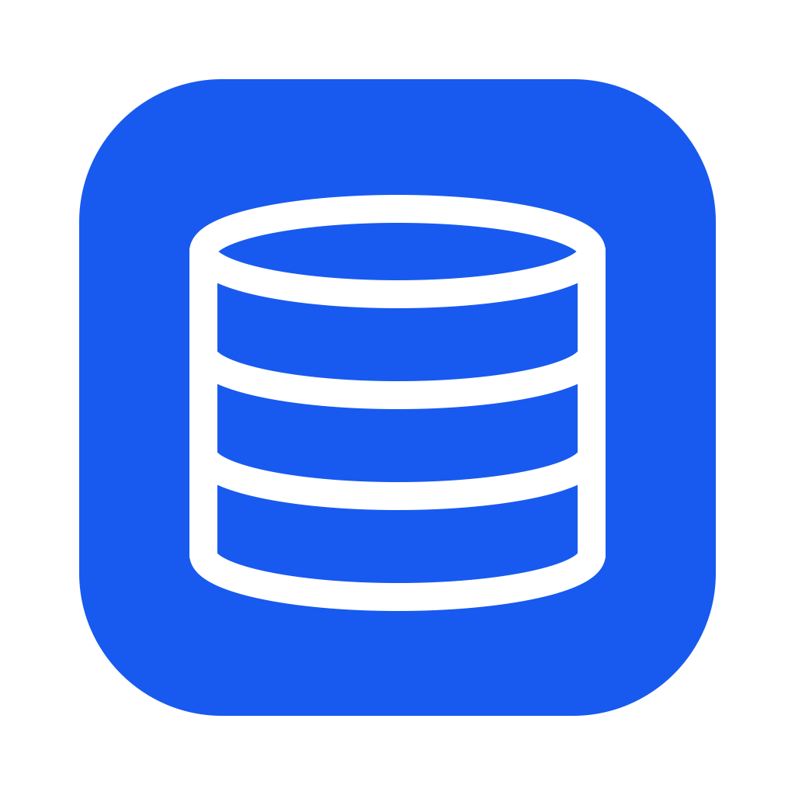

<div align="center">
  
  <h1>dboard</h1>
  <p><strong>Your databases. One native workspace.</strong></p>
  <p>Query, inspect and edit PostgreSQL, MySQL / MariaDB, SQLite and MongoDB<br>from a Rust desktop client for macOS, Windows and Linux.</p>
  <p><a href="https://github.com/alcolopa/dboard/releases/latest">Download</a> · <a href="https://alcolopa.github.io/dboard/">Website</a> · <a href="CONTRIBUTING.md">Contribute</a> · <a href="https://github.com/alcolopa/dboard/issues/new/choose">Feedback</a></p>
  <p><a href="https://github.com/alcolopa/dboard/actions/workflows/cross.yml"></a> <a href="LICENSE"></a></p>
</div>

## Why dboard?

For developers who need to understand a schema, debug a query, or fix a row without switching between tools. dboard brings browsing, SQL, inline editing and an inspector into one native workspace, built with [Rust](https://www.rust-lang.org/) and [Slint](https://slint.dev/).

- **Explore your data.** Browse database objects, inspect table structure and view relationships in an ER diagram.
- **Get to the answer.** Syntax colors, run selection, execution plans, query history and saved queries.
- **Edit deliberately.** Immediate cell editing or staged changes you review before applying; read-only connections and environment labels.
- **Keep work moving.** Multiple connections and tabs, keyboard shortcuts, command palette, imports and exports.
- **Own your tools.** MIT-licensed source, separate database drivers, and passwords stored through the OS keyring.

The [developer guide](dboard-cross/README.md) covers features, architecture and platform details. This is an actively developed project: check the limitations below before relying on it for important data.

## Get started

### Download

Choose the package for your OS and architecture from [GitHub Releases](https://github.com/alcolopa/dboard/releases/latest). Package availability and signing status depend on the release; read its notes.

| Platform | Packages |
| --- | --- |
| macOS | Apple Silicon or Intel ZIP; move `dboard.app` to Applications |
| Windows | x64 or ARM64 setup installer |
| Linux | Debian `.deb`, RPM, Arch x64 package, or x64 / ARM64 `.tar.gz` |

Saved passwords require macOS Keychain, Windows Credential Manager, or a Secret Service keyring on Linux. Linux file browsing requires an XDG desktop portal; you can also type a path.

### Build from source

Install the stable Rust toolchain and your platform's compiler. On Debian/Ubuntu, install these GUI dependencies first:

```sh
sudo apt-get install libfontconfig1-dev libxkbcommon-dev libxkbcommon-x11-dev libx11-dev libxcb1-dev libwayland-dev
```

```sh
git clone https://github.com/alcolopa/dboard.git
cd dboard/dboard-cross
cargo run --locked -p dboard
```

For an optimized binary, run `cargo build --locked --release -p dboard`. See the [developer guide](dboard-cross/README.md#local-macos-builds-and-keychain-access) for persistent local macOS signing and Keychain access.

### Your first connection

1. Create a connection, select an engine, and enter your database details (or choose a SQLite file).
2. Start with a local or development database. Use a read-only connection for inspection.
3. Test the connection, connect, and open a table or query tab.
4. Run SQL with **Ctrl+Enter** (**Cmd+Enter** on macOS). Use **Ctrl/Cmd+K** to discover commands.

**Immediate edits write when confirmed.** Enable staged edits when you want to review pending cell changes before applying them. Destructive-query confirmations and undo do not replace database permissions or backups; undo supports specific edits, not arbitrary SQL rollback.

## Support and current limits

| Engine / platform | Validation recorded in the developer guide |
| --- | --- |
| PostgreSQL | End-to-end testing with PostgreSQL 16 |
| MySQL / MariaDB | End-to-end testing with MariaDB 10.11 |
| SQLite | Driver and dedicated integration tests in the workspace |
| MongoDB | Tested and working; MongoDB user management remains unverified |
| Windows | Built by CI; manual validation still needed |

- Query results display at most 5,000 rows; result exports use loaded data. Grid copying operates on the current page.
- Database exports are portable scripts, not complete backups of every server object or permission. See the developer guide for exclusions.
- Imports cannot be cancelled once started.
- Inline editing without a primary key is supported on PostgreSQL through `ctid`; MySQL tables without a primary key stay read-only.

## Contribute

Useful contributions include reproducible bug reports, testing on Windows or MongoDB user management, documentation improvements, and focused fixes. Read [CONTRIBUTING.md](CONTRIBUTING.md) for setup, checks and pull request guidance, and [ROADMAP.md](ROADMAP.md) for current priorities.

Report bugs and feature requests through [issues](https://github.com/alcolopa/dboard/issues/new/choose). For vulnerabilities, follow [SECURITY.md](SECURITY.md). Community participation follows our [code of conduct](CODE_OF_CONDUCT.md).

## Repository

| Path | Purpose |
| --- | --- |
| [`dboard-cross/crates/core`](dboard-cross/crates/core) | Database drivers, configuration, safety checks and edit history |
| [`dboard-cross/crates/app`](dboard-cross/crates/app) | Slint UI and application workers |
| [`dboard-cross/packaging`](dboard-cross/packaging) | Platform installers and app bundles |
| [`docs`](docs) | GitHub Pages website |
| [`.github/workflows`](.github/workflows) | Tests, platform builds, releases and Pages deployment |

## Support dboard

If dboard helps your work, you can optionally support development with **USDT on Arbitrum One**.

```text
0x157F29dF2DF3760A96D8AbeFF9c0c93004Eb0de0
```

Check the token, network and destination address before sending. The [website donation section](https://alcolopa.github.io/dboard/#donate) includes a copy button. Bug reports, testing and contributions are welcome too.

## License

[MIT](LICENSE). Bundled fonts and third-party dependencies retain their own licenses; font notices are in `dboard-cross/crates/app/ui/fonts/`.
